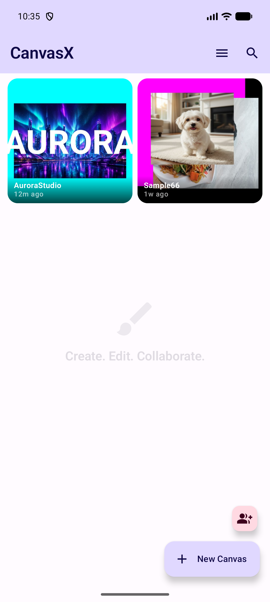
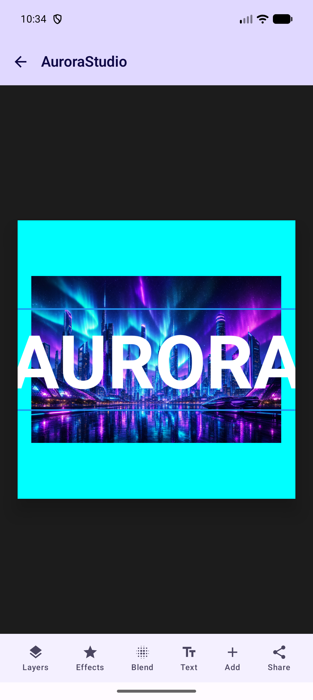
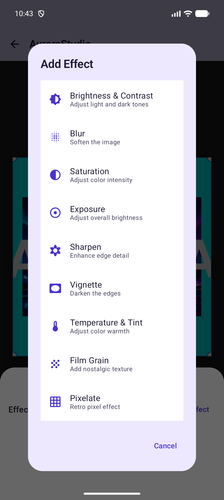
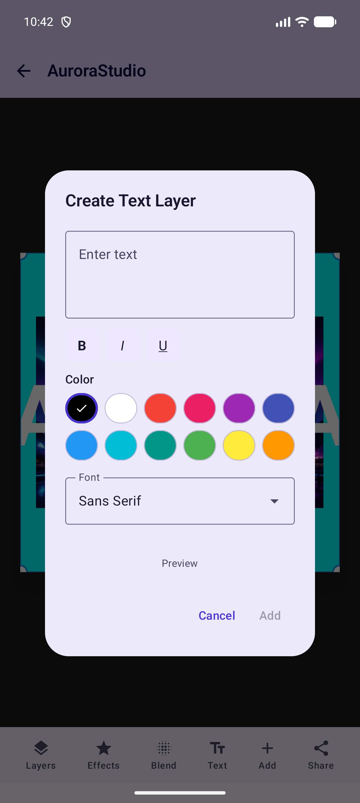
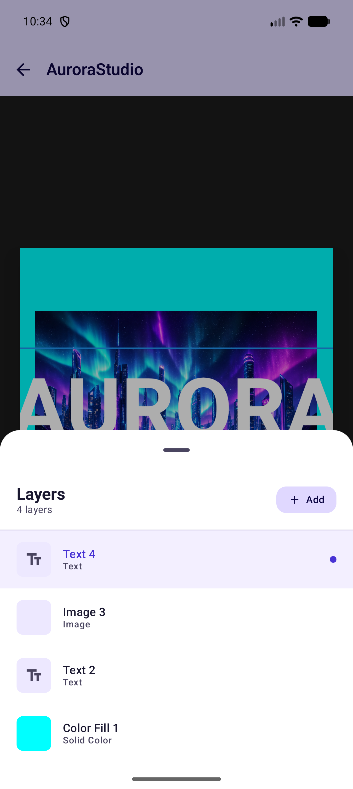
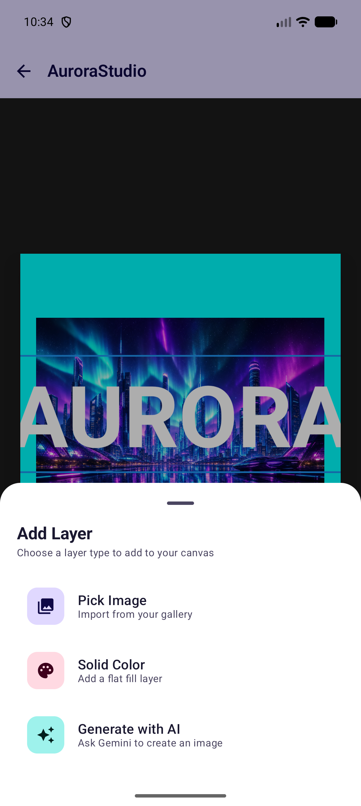

# CanvasX

CanvasX is a collaborative Android image editor built with Kotlin, Jetpack Compose, Firebase, Room, Hilt, and a custom GPU-assisted rendering pipeline. It is designed for fast layer-based editing, real-time collaboration, and AI-assisted image generation in a polished mobile experience.

  
  
  
  

## Why It Stands Out

- Real-time collaborative canvas editing backed by Firebase Realtime Database and Firestore.
- Layer-based image editor with image, solid color, text, and AI-generated layers.
- GPU-assisted rendering with AGSL shaders, blend modes, effects, transforms, caching, and responsive gesture feedback.
- Offline-first canvas library powered by Room and Firebase sync.
- Clean Compose UI with Material 3, edge-to-edge support, bottom sheets, dialogs, and adaptive surfaces.
- Google authentication, share codes, collaborator management, account deletion, and local session cleanup.
- Gemini-powered image generation flow that inserts AI output as a canvas layer.

## Engineering Highlights

CanvasX has several implementation details that go beyond a standard CRUD Android app:

- **Hybrid render pipeline:** The editor uses an instant Compose display path for responsive gestures and a background processing path for expensive image work. This keeps dragging, scaling, and layer selection responsive while the render engine recomputes processed bitmaps asynchronously.
- **GPU-assisted effects with AGSL:** Effects are implemented with Android Graphics Shading Language shaders and rendered through `RenderNode`, `HardwareRenderer`, and `ImageReader`. Moving effect work onto the GPU is a better fit for pixel-heavy operations like blur, saturation, exposure, sharpening, vignette, grain, and color temperature than repeatedly transforming large bitmaps on the UI thread.
- **Render caching:** Processed layer bitmaps are cached by layer so unchanged layers do not need to be reprocessed on every frame. The UI first asks the cache for an effect-processed bitmap and falls back to the raw source image when needed.
- **Real-time collaboration via lightweight ops:** Canvas edits sync as small operation events such as `transform`, `effect`, `opacity`, `blend_mode`, `layer_add`, and `layer_remove`. Large image blobs are uploaded once to Firebase Storage, while Realtime Database carries only the layer metadata and operation stream.
- **50 ms operation throttle:** Transform and effect changes are throttled to one network op every 50 ms, roughly 20 updates per second. That keeps collaboration fluid without flooding Firebase during drag gestures; final pointer-up state is still sent immediately so collaborators land on the exact final position.
- **Optimistic local updates:** Local layer state updates immediately before remote sync completes, so the editor feels instant even while Firebase writes happen in the background.
- **Offline-first library:** Room stores the canvas library, pinned state, metadata, and thumbnails locally. Firebase sync refreshes the local cache, but the home screen stays fast and useful even across app restarts.
- **Separated storage model:** Firestore stores canvas library and membership metadata, Realtime Database stores fast collaboration state, and Firebase Storage stores original layer images and generated thumbnails. This avoids pushing image bytes through the real-time collaboration channel.
- **Session cleanup and ownership handling:** The app clears local user data on logout/account switch and includes collaborator removal, ownership transfer, share codes, and account deletion flows.

## Screenshots

| Canvas Library | Editor | Layers | Add Layer | Effects | Text |
|---|---|---|---|---|---|
|  |  |  |  |  |  |

## Feature Set

CanvasX supports creating and joining shared canvases, pinning and searching projects, renaming or deleting canvases, and managing collaborators. Inside the editor, users can add image, solid color, text, and AI-generated layers; transform layers with touch gestures; adjust opacity and blend modes; apply effects such as saturation, blur, sharpen, exposure, vignette, grain, pixelate, and color temperature; and export or share the final composition.

The app keeps canvas metadata locally in Room for a fast library experience, synchronizes remote state through Firebase, and stores source images and thumbnails in Firebase Storage. Real-time layer operations are pushed as small collaboration events instead of repeatedly uploading large image files.

## Tech Stack

- Kotlin and Jetpack Compose
- Material 3 and AndroidX Navigation
- Hilt dependency injection
- Room local persistence
- Firebase Authentication, Firestore, Realtime Database, and Storage
- Google Sign-In
- Kotlin Serialization and Coroutines/Flow
- Coil image loading
- AGSL shaders, Android Canvas APIs, RenderNode, and HardwareRenderer
- Gemini image generation API
- JUnit and Android instrumented tests

## Architecture

The project follows a layered Android architecture:

- `domain`: canvas, layer, collaborator, effect, and repository contracts.
- `data`: Firebase repositories, Room entities/DAO/database, bitmap loading, thumbnail storage, and export helpers.
- `engine`: render loop, GPU shader rendering, transforms, blend modes, and render caching.
- `ui`: Compose screens for authentication, the canvas library, editor, navigation, and theme.
- `di`: Hilt modules for Firebase, storage, database, repositories, and rendering services.

Rendering is split into an instant display path and an asynchronous processing path. The editor can keep gestures responsive while background rendering applies heavier effects and recomposites the canvas.

## Project Highlights For Reviewers

- Built a non-trivial image editing engine rather than relying on a single off-the-shelf editor component.
- Designed a Firebase collaboration model that syncs lightweight layer operations and stores image blobs separately.
- Used Compose state, ViewModels, Flows, and Hilt to keep UI and data responsibilities separated.
- Added account/session cleanup and local persistence so the app behaves predictably across sign-in, sign-out, and account deletion.
- Captured the final screenshots from a running Pixel 9 Pro emulator with a real authenticated app session.

## License

This project is intended as a portfolio project. Add a license before accepting external contributions or reuse.
